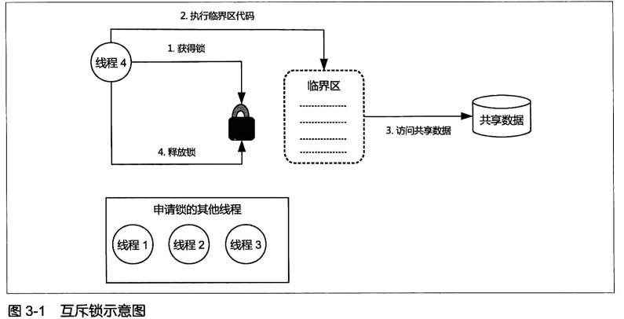

# Chapter 3  Java线程同步机制

## 3.1 线程同步机制简介

​	1.**线程同步机制** 是一套用于协调线程间的数据访问及活动的机制，该机制用于*保障线程安全*以及实现这些线程的共同目标。

​	2.从广义上将，Java平台提供的线程同步机制包括***锁***，***volatile***，***final***，***static***以及一些相关的***API***，如：***Object.wait()/Object.notify()***。

## 3.2 锁概述

1. 线程不安全的前提是多个线程并发访问共享数据，因此，我们容易想到应对这种多个线程同时访问共享数据的措施就是讲多个线程对共享数据的并发访问改为串行访问，即一个共享数据同一时刻只能被一个线程访问，该线程访问结束后其他线程才能对其进行访问，**锁(Lock)**就是利用这种思路进行线程安全的保证的。

2. 一个线程在访问共享数据前必须申请相应的锁，线程的这个动作被称为**锁的获得(acquire)**，一个线程获得某个锁，我们就称该线程为相应锁的持有线程，***一个锁一次只能被一个线程持有***。锁的持有线程可以对该锁保护的共享数据进行访问，访问结束后该线程必须**释放(release)**锁。锁的持有线程在其获得锁之后和释放锁之前的这段时间内锁操作的代码被称为**临界区(Critical Section)**。因此：==共享数据只允许在临界区被访问，且临界区一次只能被一个线程执行==。

3. 锁具有***排他性***，即一个锁一次只能被一个线程所持有，因此这种所被称为**排它锁**或**互斥锁**。后续还会提到一种**读写锁**，它是==排他锁==的一种改进。

   

4. 按照JVM对锁的==**实现方式划分**==，Java平台中的锁包括**内部锁(Instrinsic Lock)**和**显式锁(Explicit Lock)**。内部锁是通过**synchronized**关键字来实现的，显式锁是通过**Lock**(如：java.concurrent.locks.ReentrantLock类)的实现类实现的。

   ### 3.2.1 锁的作用

   1. 锁能够保护共享数据以实现线程安全，其作用包括保障原子性，可见性和有序性；
   2. 锁是通过**互斥来保障原子性的**，因此一个锁一次只能由一个线程持有，那么该线程访问临界区时是不会受到其他线程操作共享数据的干扰的，这就使得临界区代码所执行的操作自然而然具备不可分割的特性，即具备了原子性；从互斥的角度看，锁其实就是将多个线程对共享数据的访问由并发转变为串行；
   3. 可见性的保障是通过写线程冲刷处理器缓存和读线程刷新处理器缓存这两个动作实现的，在Java平台中，锁的获得隐含着刷新处理器缓存这个动作，这使得读线程在执行临界区代码前（获得锁之后）可以将写线程对共享变量所做的更新同步到该线程执行处理器的高速缓存中，而锁的释放隐含着冲刷处理器高速缓存这个动作，这使得写线程对共享变量所做的更改能够被刷新到该线程执行处理器的告诉缓存中；因此，**锁能够保证可见性**。
   4. 锁能够保障有序性，写线程在临界区中锁执行的一系列操作在读线程锁执行的临界区看起来像是完全按照源代码顺序执行的。尽管锁能够保障有序性，但是这并不意味着临界区内的内存操作不会被重排序，临界区内的任意两个操作依然可以在临界区之内被重排序，**只是不会被重排序到临界区之外**，由于临界区内的操作是具有原子性的，写线程在临界区内对各个共享数据的更新同时对读线程可见，因此这种重排序并不会影响其他线程；
   5. 需要注意的是锁对原子性，可见性和有序性的保障是有2个必须同时满足的条件：
      - 这些线程在访问同一组共享数据的时候必须用的是同一个锁；
      - 这些线程中的任意一个线程，即使其仅仅是读取这组共享数据而没有对其进行更新的话，也需要在读取时持有相应的锁。
   
   ### 3.2.2 与锁有关的几个概念
   
   1. **可重入性**
   
      ***可重入性(Reentrancy)***描述的是一个线程在其持有一个锁的时候能否再次(或多次)申请该锁，如果可以申请，那么**该锁**就是可重入的，否则就是**非可重入的**：
   
      ```java
      void methodA() {
          acquireLock(lokc);  //申请锁lock
          methodB();  //调用方法B
          releaseLock(lock);  //释放锁lock
      }
      
      void methodB() {
          acquireLock(lock); //申请锁lock
          releaseLock(lock); //释放锁lock
      }
      ```
   
      ​	方法methodA中使用了锁lock，该锁引导的临界区中又调用了methodB，而方法B也需要使用锁lock，即该线程在methodA中已经获得了该锁的时候在methodB中仍旧需要获得该锁，可重入性便是描述这样一个问题。
   
      - 可重入锁可以被理解为一个对象，该对象包含一个计数器属性，计数器属性的初始值为0，表示相应的锁还没有被任何线程持有，每次线程获得一个可重入锁的时候，该锁的计数器值会被增加1，每次一个线程释放锁的时候，该锁的计数器属性值就会减少1。
   
   2. 锁的争用与调度
   
      Java平台中的锁的==**调度策略**==包括公平策略和非公平策略，相应的锁就被称为公平锁和非公平锁，**内部锁属于非公平锁，而显示锁既支持公平锁也支持非公平锁**。

## 3.3 内部锁：synchronized关键字

1. Java平台中的任何一个**对象**都有唯一一个与之关联的锁，这种所被称为**监视器(Monitor)**或者**内部锁(Intrinsic Lock)**，***内部锁是一种排他锁，内部锁属于非公平锁，内部锁可以保障原子性，可见性和有序性***；

2. 内部锁是通过synchronized关键字修饰的，synchronized关键字可以用来修饰方法和代码块；synchronized关键字修饰的方法被称为**同步方法**(Synchronized Method)，其中：修饰的静态方法称为**同步静态方法**，修饰的实例方法称为**同步实例方法**。同步方法的**整个方法体**就是一个**临界区**。

3. synchronized修饰的代码块被称为**同步块(Synchronized Block)**，

   ```java
   synchronized(锁句柄) {
   	//再次访问共享数据
   }
   ```

   ​	synchronized关键字所引导的代码块就是临界区，**锁句柄是一个对象的引用或能够返回对象的表达式**，例如，锁句柄可以填写为this关键字(表示当前对象)，作为锁句柄的变量通常用final修饰，这是因为锁句柄的值一旦改变，会导致执行同一个同步块的多个线程实际上使用的不是同一个锁，从而对共享数据产生竞态，因此我们常用***private final***修改锁句柄：

   ```java
   private final Object lock = new Object();
   ```

4. 同步**静态方法**方法相当于是以当前类本身作为锁句柄的同步块：

   ```java
   public class Demo {
   	public static synchronized void staticMethod() {
   		//临界区
   	} 
   }
   
   //相当于：
   public class Demo {
   	public static void staticMethod() {
   		synchronized {
   			//临界区
   		}
   	}
   }
   ```

   

5. 需要额外注意的是：JVM对同步块和同步方法的处理方式是不同的；

6. 内部锁的调度：首先，**JVM会为每个内部锁分配一个入口集(Entry Set)，用于存放申请锁失败的线程。**多个线程申请同一个锁的时候，只有一个申请者能够成为该锁的持有线程，而其他申请者的申请操作会失败，这些申请失败的线程不会抛出异常，而是会被暂停（生命周期状态变为BLOCKED状态）并被存入到**相应锁**的入口集中。当这些线程申请的锁被其持有线程释放后，该锁的入口集中的一个任意线程会被JVM唤醒，从而得到再次申请锁的机会，但是JVM对内部锁的调度仅支持非公平调度，被唤醒的等待线程占用处理器运行时还可能有其他新的活跃线程（RUNNABLE状态，且没有进入到入口集中）与该线程争抢锁，**因此被唤醒的线程不一定能够成为该锁的持有线程。**

## 3.4 显示锁：Lock 接口

​	


